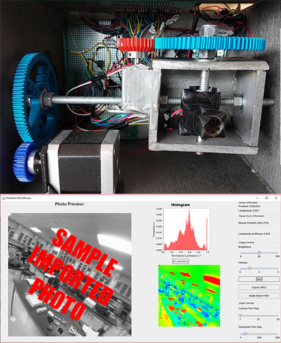

# PixelShot300
This software is used to interface with the PixelShot 300, a one pixel camera designed to capture a 300 x 300 image within 5 minutes. Written in Java and Arduino, it controls the motors and sensors, undistorts the captured fisheye image, can demosaic a Bayer colour filter image, and balances colours and brightness.

Pictured below is a view of the internals of the camera. You can see the single-pixel lens, the gear system used to rotate it, and the circuit board in the background. Below that picture is a screenshot of the Java interface to use the camera.

